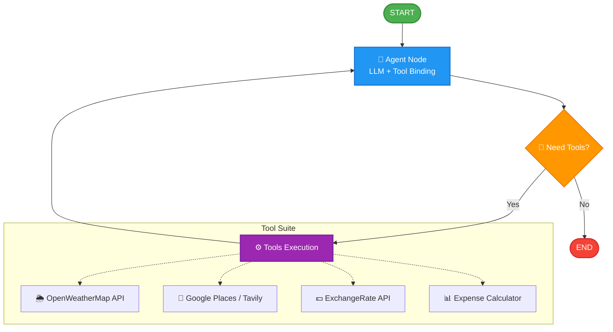

# 🌍 AI Agentic Trip Planner

An advanced, premium agentic travel planner built with a **ReAct model loop** using **LangGraph**, **FastAPI**, and a gorgeous **Streamlit** user interface. This application acts as a personal smart travel agent, integrating real-time weather data, attraction searches, currency conversion, and budgets to construct detailed, personalized travel itineraries.

---

## 🚀 Key Features

* **🧠 Multi-Agent Orchestration**: Powered by LangGraph's state machine using models via Groq (e.g., `openai/gpt-oss-120b`, `llama-3.3-70b`) or OpenAI.
* **🌦️ Real-time Weather Integration**: Leverages OpenWeatherMap API to check weather and forecast data for targeted travel locations.
* **📍 Dynamic Places Search**: Seamlessly queries Google Places API for restaurants, popular attractions, and activities, with a robust fallback to Tavily Search.
* **💰 Budgeting & Conversions**: Standard calculation tools joined with live currency exchange rate lookups for seamless travel budgeting.
* **🖥️ Interactive Chat UI**: Fully responsive, sleek dark-themed Streamlit application that renders rich, formatted markdown itineraries.

---

## 📐 Architecture Flow



---

## 🛠️ Installation & Setup

This project uses **`uv`** for extremely fast dependency and virtual environment management.

### 1. Initialize Virtual Environment

```bash
# Deactivate any active Conda or global environments first
conda deactivate

# Create a virtual environment using python 3.12 (or 3.10)
uv venv env --python 3.12.4

# Activate the virtual environment (Windows)
env\Scripts\activate
```

### 2. Install Dependencies

```bash
# Install packages using uv
uv pip install -r requirements.txt
```

### 3. Environment Configuration

Create a **`.env`** file in the root directory (you can copy the template structure from `.env.name`) and add your respective API keys:

```ini
GROQ_API_KEY=your_groq_api_key
OPENAI_API_KEY=your_openai_api_key

# Optional (Features will fallback gracefully if left empty)
GPLACES_API_KEY=your_google_places_api_key
TAVILY_API_KEY=your_tavily_api_key
OPENWEATHERMAP_API_KEY=your_openweathermap_api_key
EXCHANGE_RATE_API_KEY=your_exchangerate_api_key
```

---

## 🏃 Running the Application

To run the full suite, you need to spin up **both** the FastAPI backend and the Streamlit frontend. Ensure your virtual environment is activated in both terminals.

### Terminal 1: Spin up the FastAPI Backend

```bash
uvicorn main:app --port 8000
```

### Terminal 2: Spin up the Streamlit Frontend

```bash
streamlit run streamlit_app.py
```

The frontend will be active at [http://localhost:8501](http://localhost:8501).